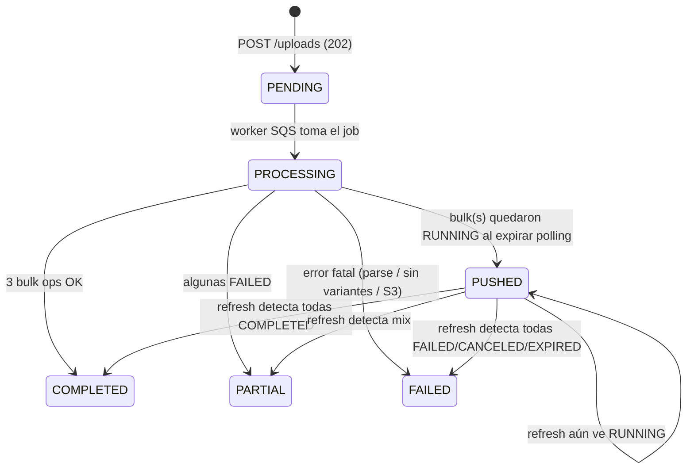
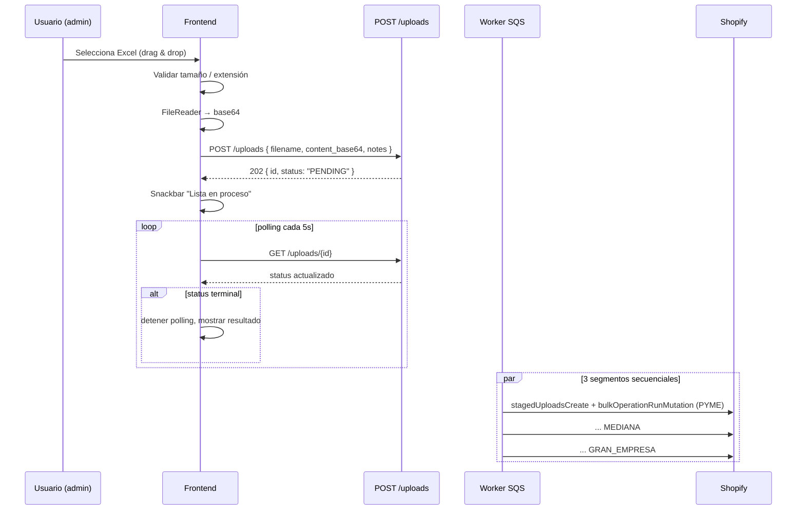

# Guía — Listas de precio B2B (Shopify Catalog) en el panel admin

Documentación para implementar el módulo **Listas de precio** en el SPA admin: subir el Excel, monitorear el procesamiento async y consultar los catálogos B2B creados en Shopify.

> **Concepto clave:** las listas de precio NO se guardan en la BD del backend. El Excel es la fuente de verdad sólo en el momento de la subida; el resultado vive en **Shopify como B2B `Catalog` + `PriceList`** por segmento (PYME, MEDIANA, GRAN_EMPRESA). El backend conserva sólo un **log de uploads** y los **GIDs** de los recursos creados en Shopify.

**Servicio backend:** `prices` (Serverless `apro-click-admin-prices`).

### URL base del API (dev)

Tras un deploy exitoso del servicio, la salida incluye `HttpApiUrl`, por ejemplo:

`https://abcd1234.execute-api.us-east-2.amazonaws.com`

En el front:

```dotenv
VITE_PRICES_API_BASE_URL=https://abcd1234.execute-api.us-east-2.amazonaws.com
```

Para inspeccionar la salida sin redeploy:

```bash
npm run sls:service -- prices info --verbose
```

---

## 1. Autenticación y roles

| Requisito | Valor |
|-----------|-------|
| Header    | `Authorization: Bearer <access_token>` |
| Token     | **Access token** de Cognito (el mismo que el resto del panel) |

### Permisos

Definidos en el backend (`WRITE_ROLES = {SUPERADMIN, ADMIN}`):

| Acción | `SUPERADMIN` | `ADMIN` | `SALES` | `KPI_VISUALIZERS` |
|--------|:-----------:|:-------:|:-------:|:-----------------:|
| Ver uploads (listado / detalle) | ✅ | ✅ | ✅ | ✅ |
| Ver segmentos (catálogos B2B) | ✅ | ✅ | ✅ | ✅ |
| Subir Excel nuevo (`POST /uploads`) | ✅ | ✅ | ❌ | ❌ |
| Refrescar status (`POST /uploads/{id}/refresh`) | ✅ | ✅ | ❌ | ❌ |

- Sin rol válido → **401**.
- Llamada de escritura desde `SALES` o `KPI` → **401** ("Sin permisos: solo SUPERADMIN/ADMIN…").

> **Recomendación UI:** ocultar el botón "Subir lista" para roles que no son `SUPERADMIN`/`ADMIN`; mostrar el listado/detalle como sólo-lectura para todos los autenticados.

---

## 2. Contrato de respuesta

Todas las respuestas exitosas siguen el formato estándar del panel:

```json
{ "statusCode": 200, "message": "OK", "data": { ... } }
```

Las creaciones (`POST /uploads`) devuelven **202** con la fila recién creada en `data` (procesamiento async; ver §3.3).

---

## 3. Modelo de datos

### 3.1 `PriceListUpload` — log de cada Excel subido

| Campo | Tipo | Descripción |
|-------|------|-------------|
| `id` | `string (UUID)` | PK del upload |
| `source_filename` | `string \| null` | Nombre original del archivo |
| `s3_bucket` / `s3_key` | `string \| null` | Ubicación del Excel guardado |
| `status` | `UploadStatus` | Ver tabla §3.2 |
| `error_message` | `string \| null` | Detalle del último error fatal |
| `notes` | `string \| null` | Texto libre del admin (opcional) |
| `parsed_items` | `int` | Filas válidas en el Excel |
| `duplicates_overwritten` | `int` | SAPs duplicados (gana la última fila) |
| `rows_skipped` | `int` | Filas descartadas (sin SAP, etc.) |
| `variants_resolved` | `int` | SKUs encontrados en Shopify |
| `variants_missing` | `int` | SKUs que NO existen en Shopify |
| `missing_skus_sample` | `string \| null` | CSV con hasta 50 SAPs faltantes (UI) |
| `segments` | `SegmentSummary` | Resumen por segmento (ver §3.4) |
| `uploaded_by_user_id` | `string \| null` | `users.id` (no `cognito_sub`) |
| `created_at` / `updated_at` | `string (ISO)` | |

### 3.2 `UploadStatus`

| Valor | Significado | Frontend |
|-------|-------------|----------|
| `PENDING` | Recién creado, esperando que el worker lo tome de SQS | Spinner. Polling cada 5 s. |
| `PROCESSING` | El worker está leyendo el Excel y/o resolviendo variantes | Spinner. Polling cada 5 s. |
| `PUSHED` | Una o más bulk operations en Shopify quedaron `RUNNING`/`CREATED` cuando expiró el polling. Hay que refrescar para saber el estado actual. | Mostrar "Procesando en Shopify" + botón **Refrescar**. Polling cada 10 s o pedir refresh manual. |
| `COMPLETED` | Las 3 bulk operations terminaron en `COMPLETED`. | ✅ Verde. Detener polling. |
| `PARTIAL` | Al menos un segmento `COMPLETED` y al menos uno `FAILED`. | ⚠️ Naranja. Mostrar detalle por segmento. |
| `FAILED` | Error fatal antes o durante el push (ningún segmento llegó a `COMPLETED`). | 🔴 Rojo. Mostrar `error_message`. |

### 3.3 Diagrama de transiciones



### 3.4 `SegmentSummary` — el campo `segments` en `PriceListUpload`

Devuelto siempre con las 3 claves fijas. Cada segmento mapea 1:1 con un `Catalog` + `PriceList` en Shopify.

```json
{
  "segments": {
    "PYME": {
      "bulk_operation_gid": "gid://shopify/BulkOperation/...",
      "bulk_status": "COMPLETED"
    },
    "MEDIANA": {
      "bulk_operation_gid": "gid://shopify/BulkOperation/...",
      "bulk_status": "COMPLETED"
    },
    "GRAN_EMPRESA": {
      "bulk_operation_gid": null,
      "bulk_status": null
    }
  }
}
```

| Campo | Valores | Notas |
|-------|---------|-------|
| `bulk_operation_gid` | `string \| null` | GID de la `BulkOperation` en Shopify. `null` mientras no se haya lanzado ese segmento. |
| `bulk_status` | `'CREATED' \| 'RUNNING' \| 'COMPLETED' \| 'FAILED' \| 'CANCELED' \| 'EXPIRED' \| null` | Estado tal como lo reporta Shopify. |

### 3.5 `ShopifyPriceSegment` — catálogos B2B (1 por segmento)

Devuelto por `GET /segments`:

| Campo | Tipo | Descripción |
|-------|------|-------------|
| `id` | `string (UUID)` | PK |
| `segment` | `'PYME' \| 'MEDIANA' \| 'GRAN_EMPRESA'` | |
| `shop_domain` | `string` | `xxx.myshopify.com` |
| `catalog_gid` | `string \| null` | `gid://shopify/CompanyLocationCatalog/...` o `null` si todavía no se asoció a `companyLocationIds` |
| `price_list_gid` | `string \| null` | `gid://shopify/PriceList/...` |
| `currency` | `string` | `'CLP'` por default |
| `company_location_ids` | `string \| null` | CSV de `gid://shopify/CompanyLocation/...` asociados al catálogo |
| `created_at` / `updated_at` | `string (ISO)` | |

> **Cuándo es `catalog_gid` null:** cuando, al momento del primer upload, no había ninguna empresa aprobada del segmento (tabla `companies` vacía para `company_type` correspondiente, o sin `shopify_company_id`). En ese caso sólo se creó el `PriceList` (los precios fijos están cargados pero NO son visibles para ningún cliente B2B). Una vez aprobada al menos una empresa del segmento, llamar **`POST /api/v1/prices/segments/{segment}/rebuild-catalog`** para crear el `Catalog` y asociarlo al `PriceList` existente.

#### 3.5.1 Mapeo segmento ↔ `company_type`

El backend resuelve automáticamente las `CompanyLocation` que pertenecen a cada catálogo según el `company_type` de la tabla `companies`:

| Segmento | `company_type` BD |
|----------|-------------------|
| `PYME`         | `SMALL`  |
| `MEDIANA`      | `MEDIUM` |
| `GRAN_EMPRESA` | `BIG`    |

Para que una empresa aparezca en su catálogo B2B se necesitan dos cosas:

1. La fila en `companies` con el `company_type` correcto.
2. `companies.shopify_company_id` poblado (se setea al aprobar el registro de la empresa, que es cuando se crea la `Company` en Shopify).

---

## 4. Endpoints

### 4.1 Health

```
GET /api/v1/health-prices
```

Respuesta: `{ "status": "healthy", "service": "..." }`. Pública, sin auth.

---

### 4.2 Subir Excel — `POST /api/v1/prices/uploads`

Sólo `SUPERADMIN` / `ADMIN`.

**Body JSON:**

```json
{
  "filename": "Lista de Precios Apro Mayo 2026.xlsx",
  "content_base64": "UEsDBBQABgAIAAAAIQ...",
  "notes": "Lista vigente desde mayo 2026"
}
```

| Campo | Obligatorio | Tipo | Notas |
|-------|:-----------:|------|-------|
| `content_base64` | ✅ | `string` | Excel **completo** codificado en base64 estándar. |
| `filename` | ❌ | `string` | Sólo para auditoría/UI. |
| `notes` | ❌ | `string` | Texto libre, queda en `notes`. |

**Límites:**

- Tamaño máximo del archivo decodificado: **5 MB** (la Lambda lo valida; supera ⇒ **400**).
- API Gateway HTTP API tiene un tope de payload de **6 MB**. Con base64 (~33% overhead) un Excel de ~4 MB es lo más grande que conviene mandar.

**Respuesta — 202 Accepted:**

```json
{
  "statusCode": 202,
  "message": "Upload encolado para procesamiento",
  "data": {
    "id": "8f7e3c4a-9d2b-4e1f-a834-1b2c3d4e5f60",
    "source_filename": "Lista de Precios Apro Mayo 2026.xlsx",
    "s3_bucket": "apro-click-prod-prices-uploads",
    "s3_key": "2026/05/8f7e3c4a-9d2b-4e1f-a834-1b2c3d4e5f60/...",
    "status": "PENDING",
    "error_message": null,
    "notes": "Lista vigente desde mayo 2026",
    "parsed_items": 0,
    "duplicates_overwritten": 0,
    "rows_skipped": 0,
    "variants_resolved": 0,
    "variants_missing": 0,
    "missing_skus_sample": null,
    "segments": {
      "PYME":          { "bulk_operation_gid": null, "bulk_status": null },
      "MEDIANA":       { "bulk_operation_gid": null, "bulk_status": null },
      "GRAN_EMPRESA":  { "bulk_operation_gid": null, "bulk_status": null }
    },
    "uploaded_by_user_id": "...",
    "created_at": "2026-05-08T18:00:00.000Z",
    "updated_at": "2026-05-08T18:00:00.000Z"
  }
}
```

**A partir de aquí: polling con `GET /uploads/{id}` hasta que `status` ∈ {`COMPLETED`, `PARTIAL`, `FAILED`}.**

**Errores típicos:**

| Código | Mensaje | UI |
|--------|---------|----|
| 400 | `content_base64 es requerido (string base64 con el Excel)` | Validación previa al submit. |
| 400 | `content_base64 inválido: ...` | Verificar codificación; reintentar. |
| 400 | `El archivo decodificado está vacío` | El admin subió un archivo de 0 B. |
| 400 | `El archivo supera el máximo permitido (5 MB)` | Mostrar contador de tamaño y bloquear. |
| 401 | `Se requiere Authorization: Bearer` | Token expirado / sin sesión. |
| 401 | `Sin permisos: solo SUPERADMIN/ADMIN…` | Ocultar el botón antes; igual mostrar snackbar si llega. |
| 500 | `PRICES_UPLOADS_BUCKET no está configurado…` | Misconfig del backend; avisar a infra. |

---

### 4.3 Listar uploads — `GET /api/v1/prices/uploads`

| Query | Obligatorio | Default | Descripción |
|-------|:-----------:|---------|-------------|
| `limit` | ❌ | `50` | Máx **200**. |
| `offset` | ❌ | `0` | Paginación clásica. |

**Respuesta:**

```json
{
  "statusCode": 200,
  "message": "OK",
  "data": {
    "uploads": [ /* PriceListUpload[] */ ],
    "total": 17,
    "limit": 50,
    "offset": 0
  }
}
```

Orden por `created_at DESC`. Útil para una `DataGrid` con paginación server-side.

---

### 4.4 Detalle — `GET /api/v1/prices/uploads/{upload_id}`

Devuelve un `PriceListUpload`. **404** si no existe.

```json
{
  "statusCode": 200,
  "message": "OK",
  "data": { /* PriceListUpload */ }
}
```

> **Polling:** este endpoint es el que se llama mientras el upload está en `PENDING` / `PROCESSING` / `PUSHED`. La fila se va llenando con los contadores y los GIDs de Shopify a medida que el worker avanza.

---

### 4.5 Refrescar status — `POST /api/v1/prices/uploads/{upload_id}/refresh`

Sólo `SUPERADMIN` / `ADMIN`. Pre-condición típica: `status === 'PUSHED'` (alguna bulk op de Shopify quedó `RUNNING` cuando el worker terminó).

**Body:** vacío (`{}`).

**Qué hace en el backend:**

1. Para cada segmento con `bulk_operation_gid` no null, consulta Shopify (`node(BulkOperation)`) y actualiza `*_bulk_status`.
2. Recalcula el `status` global:
   - todos `COMPLETED` → `COMPLETED`,
   - mix → `PARTIAL`,
   - todos `FAILED`/`CANCELED`/`EXPIRED` → `FAILED`,
   - hay `RUNNING`/`CREATED` → sigue `PUSHED`.

**Respuesta:** la fila actualizada (mismo shape que `GET`).

**Errores:**

| Código | Caso |
|--------|------|
| 400 | `upload_id` no es un UUID válido. |
| 401 | sin rol de escritura. |
| 404 | upload no existe. |
| 500 | error consultando Shopify (mostrar y permitir reintento manual). |

---

### 4.6 Catálogos B2B — `GET /api/v1/prices/segments`

```json
{
  "statusCode": 200,
  "message": "OK",
  "data": {
    "segments": [
      {
        "id": "...",
        "segment": "GRAN_EMPRESA",
        "shop_domain": "apro-click.myshopify.com",
        "catalog_gid": null,
        "price_list_gid": "gid://shopify/PriceList/...",
        "currency": "CLP",
        "company_location_ids": null,
        "created_at": "...",
        "updated_at": "..."
      },
      { "segment": "MEDIANA",  ... },
      { "segment": "PYME",     ... }
    ]
  }
}
```

Si todavía no se subió ningún Excel, `data.segments` puede estar vacío. Después del primer upload completo, devuelve 3 filas (una por segmento).

> **UI:** mostrar en una sección **"Catálogos B2B en Shopify"** con un link al Shopify Admin (`https://<shop>.myshopify.com/admin/products/price-lists/<priceListId-numérico>`).

---

### 4.7 Reconstruir Catalog del segmento — `POST /api/v1/prices/segments/{segment}/rebuild-catalog`

Sólo `SUPERADMIN` / `ADMIN`.

Crea (o reutiliza) el `Catalog` Shopify del segmento y lo asocia al `PriceList` existente. Se usa cuando:

- El primer upload se hizo cuando todavía no había empresas aprobadas del segmento → quedó el `PriceList` con precios fijos pero sin `Catalog`. **Sin `Catalog`, los precios B2B NO son visibles para los clientes.** Se debe llamar a este endpoint una vez aprobada al menos una empresa.
- Se sospecha que el `Catalog` se borró manualmente desde Shopify Admin y hay que recrearlo.

**Path params:**

| Param | Valor |
|-------|-------|
| `segment` | `PYME` \| `MEDIANA` \| `GRAN_EMPRESA` |

**Body:** opcional (no se usa hoy, queda reservado).

**Cómo resuelve `companyLocationIds`:**

1. Si la env var `PRICES_B2B_<SEGMENT>_LOCATION_IDS` está seteada en el deploy (CSV de GIDs), la usa.
2. Si no, lee la tabla `companies` con `company_type = SEGMENT_COMPANY_TYPE[segment]` (ver §3.5.1) y `shopify_company_id IS NOT NULL`, y resuelve sus `CompanyLocation` desde Shopify.

**Respuesta — 200 OK:**

```json
{
  "statusCode": 200,
  "message": "OK",
  "data": {
    "segment": "PYME",
    "status": "CREATED",
    "price_list_gid": "gid://shopify/PriceList/...",
    "catalog_gid": "gid://shopify/CompanyLocationCatalog/...",
    "company_location_ids": [
      "gid://shopify/CompanyLocation/...",
      "gid://shopify/CompanyLocation/..."
    ],
    "fixed_prices_count": 8357,
    "source": "db"
  }
}
```

`status` puede ser:

| Valor | Significado |
|-------|-------------|
| `CREATED` | Se creó el `Catalog` ahora y se vinculó al `PriceList` existente. |
| `ALREADY_LINKED` | El `PriceList` ya tenía un `Catalog` (no se recrea). En `data.catalog_gid` se devuelve el existente; el backend sincroniza la BD si difería. |
| `NO_LOCATIONS` | No hay companies aprobadas para el segmento (`data.message` lo explica). El admin debe aprobar al menos una empresa del tipo correspondiente y luego llamar este endpoint de nuevo. |
| `FAILED` | Shopify rechazó la creación (`data.error` con el detalle). Mostrar al admin como toast/alerta. |

**Errores:**

| Código | Caso |
|--------|------|
| 400 | `segment` inválido (no es PYME/MEDIANA/GRAN_EMPRESA) o el segmento todavía no tiene `PriceList` (hay que subir un Excel primero). |
| 401 | Sin rol de escritura. |
| 500 | Error consultando Shopify (mostrar y permitir reintento). |

> **UX sugerida:** en la tarjeta del segmento de la página principal (§10.1), si `catalog_gid` viene `null`, mostrar un botón **"Crear catálogo en Shopify"** que llame a este endpoint y refresque el listado al volver.

---

## 5. Flujo end-to-end (UX)



**Pseudo-código del flujo en el panel:**

1. Usuario arrastra `lista.xlsx` (validar `.xlsx`, ≤ 4 MB).
2. Frontend convierte a base64 (`FileReader.readAsDataURL` → quitar prefijo `data:...;base64,`).
3. `POST /uploads` con Bearer.
4. Inicia polling cada 5 s sobre `GET /uploads/{id}`.
5. Mientras `status` ∈ {`PENDING`, `PROCESSING`}, mostrar progreso indeterminado + contadores reales (`parsed_items`, `variants_resolved/missing`).
6. Al detectar `PUSHED`, cambiar polling a 10 s y permitir botón **Refrescar manualmente**.
7. Al detectar `COMPLETED` / `PARTIAL` / `FAILED`, detener polling y mostrar resumen con detalle por segmento.

---

## 6. Tipos TypeScript

```typescript
// src/types/prices.ts

export type SegmentKey = 'PYME' | 'MEDIANA' | 'GRAN_EMPRESA';

export type UploadStatus =
  | 'PENDING'
  | 'PROCESSING'
  | 'PUSHED'
  | 'COMPLETED'
  | 'PARTIAL'
  | 'FAILED';

export type BulkStatus =
  | 'CREATED'
  | 'RUNNING'
  | 'COMPLETED'
  | 'FAILED'
  | 'CANCELED'
  | 'EXPIRED';

export interface SegmentSummary {
  bulk_operation_gid: string | null;
  bulk_status: BulkStatus | null;
}

export interface PriceListUpload {
  id: string;
  source_filename: string | null;
  s3_bucket: string | null;
  s3_key: string | null;
  status: UploadStatus;
  error_message: string | null;
  notes: string | null;
  parsed_items: number;
  duplicates_overwritten: number;
  rows_skipped: number;
  variants_resolved: number;
  variants_missing: number;
  missing_skus_sample: string | null;
  segments: Record<SegmentKey, SegmentSummary>;
  uploaded_by_user_id: string | null;
  created_at: string;
  updated_at: string;
}

export interface PriceListUploadList {
  uploads: PriceListUpload[];
  total: number;
  limit: number;
  offset: number;
}

export interface ShopifyPriceSegment {
  id: string;
  segment: SegmentKey;
  shop_domain: string;
  catalog_gid: string | null;
  price_list_gid: string | null;
  currency: string;
  company_location_ids: string | null;
  created_at: string;
  updated_at: string;
}

export interface CreateUploadPayload {
  filename: string;
  content_base64: string;
  notes?: string;
}

/** Estados terminales: dejan de hacer polling. */
export const TERMINAL_STATUSES = new Set<UploadStatus>([
  'COMPLETED',
  'PARTIAL',
  'FAILED',
]);

/** Mientras esté en alguno de estos, conviene seguir consultando. */
export const PROGRESS_STATUSES = new Set<UploadStatus>([
  'PENDING',
  'PROCESSING',
  'PUSHED',
]);
```

---

## 7. Cliente HTTP (axios)

```typescript
// src/api/prices.api.ts
import axios from 'axios';
import {
  CreateUploadPayload,
  PriceListUpload,
  PriceListUploadList,
  ShopifyPriceSegment,
} from '@/types/prices';

const baseURL = import.meta.env.VITE_PRICES_API_BASE_URL;

const client = axios.create({ baseURL });

client.interceptors.request.use((config) => {
  const token = localStorage.getItem('access_token');
  if (token) {
    config.headers.Authorization = `Bearer ${token}`;
  }
  return config;
});

type ApiEnvelope<T> = { statusCode: number; message: string; data: T };

export async function createUpload(
  payload: CreateUploadPayload,
): Promise<PriceListUpload> {
  const res = await client.post<ApiEnvelope<PriceListUpload>>(
    '/api/v1/prices/uploads',
    payload,
  );
  return res.data.data;
}

export async function listUploads(params: {
  limit?: number;
  offset?: number;
} = {}): Promise<PriceListUploadList> {
  const res = await client.get<ApiEnvelope<PriceListUploadList>>(
    '/api/v1/prices/uploads',
    { params },
  );
  return res.data.data;
}

export async function getUpload(uploadId: string): Promise<PriceListUpload> {
  const res = await client.get<ApiEnvelope<PriceListUpload>>(
    `/api/v1/prices/uploads/${uploadId}`,
  );
  return res.data.data;
}

export async function refreshUpload(uploadId: string): Promise<PriceListUpload> {
  const res = await client.post<ApiEnvelope<PriceListUpload>>(
    `/api/v1/prices/uploads/${uploadId}/refresh`,
    {},
  );
  return res.data.data;
}

export async function listSegments(): Promise<ShopifyPriceSegment[]> {
  const res = await client.get<
    ApiEnvelope<{ segments: ShopifyPriceSegment[] }>
  >('/api/v1/prices/segments');
  return res.data.data.segments;
}

export type RebuildCatalogStatus =
  | 'CREATED'
  | 'ALREADY_LINKED'
  | 'NO_LOCATIONS'
  | 'FAILED';

export interface RebuildCatalogResult {
  segment: SegmentKey;
  status: RebuildCatalogStatus;
  price_list_gid: string | null;
  catalog_gid?: string | null;
  catalog_title?: string | null;
  catalog_status?: string | null;
  company_location_ids?: string[] | null;
  fixed_prices_count?: number | null;
  source?: 'env' | 'db';
  message?: string;
  error?: string;
}

export async function rebuildSegmentCatalog(
  segment: SegmentKey,
): Promise<RebuildCatalogResult> {
  const res = await client.post<ApiEnvelope<RebuildCatalogResult>>(
    `/api/v1/prices/segments/${segment}/rebuild-catalog`,
    {},
  );
  return res.data.data;
}
```

---

## 8. Helpers para subir el Excel

### 8.1 Convertir `File` → base64 sin el prefijo `data:`

```typescript
// src/utils/fileToBase64.ts
export function fileToBase64(file: File): Promise<string> {
  return new Promise((resolve, reject) => {
    const reader = new FileReader();
    reader.onload = () => {
      const raw = String(reader.result ?? '');
      const idx = raw.indexOf(',');
      resolve(idx >= 0 ? raw.slice(idx + 1) : raw);
    };
    reader.onerror = () => reject(reader.error ?? new Error('FileReader error'));
    reader.readAsDataURL(file);
  });
}
```

### 8.2 Validación previa al submit

```typescript
const MAX_FILE_BYTES = 4 * 1024 * 1024; // 4 MB → ~5.4 MB en base64

export function validateExcelFile(file: File): string | null {
  if (!file.name.toLowerCase().endsWith('.xlsx')) {
    return 'El archivo debe ser .xlsx';
  }
  if (file.size === 0) {
    return 'El archivo está vacío';
  }
  if (file.size > MAX_FILE_BYTES) {
    return `El archivo supera 4 MB (actual: ${(file.size / 1024 / 1024).toFixed(2)} MB)`;
  }
  return null;
}
```

---

## 9. Hooks (React Query v5)

```typescript
// src/features/prices/hooks.ts
import { useMutation, useQuery, useQueryClient } from '@tanstack/react-query';
import {
  createUpload,
  getUpload,
  listSegments,
  listUploads,
  rebuildSegmentCatalog,
  refreshUpload,
} from '@/api/prices.api';
import {
  PriceListUpload,
  PROGRESS_STATUSES,
  SegmentKey,
  TERMINAL_STATUSES,
} from '@/types/prices';

const PRICES_KEYS = {
  uploads: (limit: number, offset: number) =>
    ['prices', 'uploads', limit, offset] as const,
  upload: (id: string) => ['prices', 'upload', id] as const,
  segments: () => ['prices', 'segments'] as const,
};

export function useUploadsQuery(limit = 50, offset = 0) {
  return useQuery({
    queryKey: PRICES_KEYS.uploads(limit, offset),
    queryFn: () => listUploads({ limit, offset }),
    refetchInterval: (query) => {
      const data = query.state.data;
      if (!data) return false;
      const anyInProgress = data.uploads.some((u) =>
        PROGRESS_STATUSES.has(u.status),
      );
      return anyInProgress ? 10_000 : false;
    },
  });
}

/**
 * Polling adaptativo: 5 s mientras está en PENDING/PROCESSING,
 * 10 s en PUSHED, y se detiene en estados terminales.
 */
export function useUploadDetailQuery(uploadId: string | null) {
  return useQuery({
    queryKey: PRICES_KEYS.upload(uploadId ?? ''),
    queryFn: () => getUpload(uploadId as string),
    enabled: !!uploadId,
    refetchInterval: (query) => {
      const data = query.state.data as PriceListUpload | undefined;
      if (!data || TERMINAL_STATUSES.has(data.status)) return false;
      return data.status === 'PUSHED' ? 10_000 : 5_000;
    },
  });
}

export function useCreateUploadMutation() {
  const qc = useQueryClient();
  return useMutation({
    mutationFn: createUpload,
    onSuccess: (upload) => {
      qc.invalidateQueries({ queryKey: ['prices', 'uploads'] });
      // Pre-popular el detalle para arrancar el polling sin lap inicial vacío.
      qc.setQueryData(PRICES_KEYS.upload(upload.id), upload);
    },
  });
}

export function useRefreshUploadMutation() {
  const qc = useQueryClient();
  return useMutation({
    mutationFn: refreshUpload,
    onSuccess: (upload) => {
      qc.setQueryData(PRICES_KEYS.upload(upload.id), upload);
      qc.invalidateQueries({ queryKey: ['prices', 'uploads'] });
    },
  });
}

export function useSegmentsQuery() {
  return useQuery({
    queryKey: PRICES_KEYS.segments(),
    queryFn: listSegments,
    staleTime: 60_000,
  });
}

/**
 * Crea/repara el `Catalog` Shopify de un segmento. Tras el éxito, refresca
 * el listado de segmentos para que el chip "Sin Catalog" desaparezca.
 */
export function useRebuildSegmentCatalogMutation() {
  const qc = useQueryClient();
  return useMutation({
    mutationFn: (segment: SegmentKey) => rebuildSegmentCatalog(segment),
    onSuccess: () => {
      qc.invalidateQueries({ queryKey: PRICES_KEYS.segments() });
    },
  });
}
```

---

## 10. UI sugerida

### 10.1 Página principal — `PriceListsPage`

Estructura recomendada (MUI v6):

```
┌────────────────────────────────────────────────────────┐
│ Listas de precio                          [+ Subir lista] │
├────────────────────────────────────────────────────────┤
│ ▸ Catálogos B2B activos en Shopify                      │
│   PYME           PriceList: gid://...   Catalog: gid://...  │
│   MEDIANA        PriceList: gid://...   Catalog: ⚠ no link  │
│   GRAN_EMPRESA   PriceList: gid://...   Catalog: gid://...  │
├────────────────────────────────────────────────────────┤
│ Historial de cargas                                     │
│ ┌─────────────────────────────────────────────────────┐ │
│ │ Fecha     Archivo   Status    Items   Acciones      │ │
│ │ 08/05     mayo.xlsx [✓ COMP]  11.753  [Ver]         │ │
│ │ 02/05     abril.xlsx[⚠ PART]  11.502  [Ver][Refr]   │ │
│ └─────────────────────────────────────────────────────┘ │
└────────────────────────────────────────────────────────┘
```

### 10.2 Diálogo de subida — `UploadDialog`

```typescript
// src/features/prices/UploadDialog.tsx
import { useState } from 'react';
import {
  Button, Dialog, DialogActions, DialogContent, DialogTitle,
  Stack, TextField, Alert,
} from '@mui/material';
import { useSnackbar } from 'notistack';
import { useCreateUploadMutation } from './hooks';
import { fileToBase64, validateExcelFile } from '@/utils/fileToBase64';

export function UploadDialog({
  open,
  onClose,
  onCreated,
}: {
  open: boolean;
  onClose: () => void;
  onCreated: (uploadId: string) => void;
}) {
  const [file, setFile] = useState<File | null>(null);
  const [notes, setNotes] = useState('');
  const [error, setError] = useState<string | null>(null);
  const { enqueueSnackbar } = useSnackbar();
  const createMutation = useCreateUploadMutation();

  const handleFile = (e: React.ChangeEvent<HTMLInputElement>) => {
    const f = e.target.files?.[0] ?? null;
    setFile(f);
    setError(f ? validateExcelFile(f) : null);
  };

  const handleSubmit = async () => {
    if (!file) return;
    const validationError = validateExcelFile(file);
    if (validationError) {
      setError(validationError);
      return;
    }
    try {
      const content_base64 = await fileToBase64(file);
      const upload = await createMutation.mutateAsync({
        filename: file.name,
        content_base64,
        notes: notes.trim() || undefined,
      });
      enqueueSnackbar('Lista de precios encolada para procesamiento', {
        variant: 'success',
      });
      onCreated(upload.id);
      onClose();
    } catch (err: any) {
      const msg =
        err?.response?.data?.message ?? err?.message ?? 'Error subiendo Excel';
      setError(msg);
    }
  };

  return (
    <Dialog open={open} onClose={onClose} maxWidth="sm" fullWidth>
      <DialogTitle>Subir lista de precios</DialogTitle>
      <DialogContent>
        <Stack spacing={2} mt={1}>
          <Alert severity="info">
            El Excel se procesa en segundo plano y los precios quedan disponibles
            como catálogos B2B en Shopify (PYME / MEDIANA / GRAN_EMPRESA).
          </Alert>
          <Button variant="outlined" component="label">
            {file ? file.name : 'Seleccionar archivo .xlsx'}
            <input
              hidden
              type="file"
              accept=".xlsx,application/vnd.openxmlformats-officedocument.spreadsheetml.sheet"
              onChange={handleFile}
            />
          </Button>
          <TextField
            label="Notas (opcional)"
            value={notes}
            onChange={(e) => setNotes(e.target.value)}
            multiline
            minRows={2}
          />
          {error && <Alert severity="error">{error}</Alert>}
        </Stack>
      </DialogContent>
      <DialogActions>
        <Button onClick={onClose} disabled={createMutation.isPending}>
          Cancelar
        </Button>
        <Button
          onClick={handleSubmit}
          variant="contained"
          disabled={!file || !!error || createMutation.isPending}
        >
          {createMutation.isPending ? 'Subiendo…' : 'Subir'}
        </Button>
      </DialogActions>
    </Dialog>
  );
}
```

### 10.3 Detalle / status — `UploadDetailDrawer`

```typescript
// src/features/prices/UploadDetailDrawer.tsx
import {
  Box, Button, Chip, Drawer, Divider, LinearProgress,
  List, ListItem, ListItemText, Typography,
} from '@mui/material';
import { useRefreshUploadMutation, useUploadDetailQuery } from './hooks';
import { TERMINAL_STATUSES, UploadStatus, BulkStatus } from '@/types/prices';

const statusColor = (s: UploadStatus) =>
  s === 'COMPLETED' ? 'success'
  : s === 'PARTIAL'   ? 'warning'
  : s === 'FAILED'    ? 'error'
  : 'info';

const bulkColor = (s: BulkStatus | null) =>
  s === 'COMPLETED' ? 'success'
  : s === 'FAILED' || s === 'CANCELED' || s === 'EXPIRED' ? 'error'
  : s ? 'info' : 'default';

export function UploadDetailDrawer({
  uploadId,
  onClose,
}: {
  uploadId: string | null;
  onClose: () => void;
}) {
  const { data: upload, isLoading } = useUploadDetailQuery(uploadId);
  const refresh = useRefreshUploadMutation();

  return (
    <Drawer anchor="right" open={!!uploadId} onClose={onClose}>
      <Box width={420} p={3}>
        {isLoading || !upload ? (
          <LinearProgress />
        ) : (
          <>
            <Typography variant="h6">{upload.source_filename ?? '(sin nombre)'}</Typography>
            <Typography variant="caption" color="text.secondary">
              {new Date(upload.created_at).toLocaleString('es-CL')}
            </Typography>

            <Box my={2}>
              <Chip
                label={upload.status}
                color={statusColor(upload.status)}
                sx={{ mr: 1 }}
              />
              {upload.status === 'PUSHED' && (
                <Button
                  size="small"
                  variant="outlined"
                  onClick={() => refresh.mutate(upload.id)}
                  disabled={refresh.isPending}
                >
                  Refrescar
                </Button>
              )}
            </Box>

            {!TERMINAL_STATUSES.has(upload.status) && <LinearProgress />}

            {upload.error_message && (
              <Box my={2} p={1.5} bgcolor="error.light" borderRadius={1}>
                <Typography variant="body2" color="error.dark">
                  {upload.error_message}
                </Typography>
              </Box>
            )}

            <List dense>
              <ListItem>
                <ListItemText primary="Filas parseadas" secondary={upload.parsed_items} />
              </ListItem>
              <ListItem>
                <ListItemText
                  primary="Duplicados sobreescritos"
                  secondary={upload.duplicates_overwritten}
                />
              </ListItem>
              <ListItem>
                <ListItemText
                  primary="Variantes en Shopify"
                  secondary={`${upload.variants_resolved} OK / ${upload.variants_missing} faltantes`}
                />
              </ListItem>
            </List>

            {upload.variants_missing > 0 && upload.missing_skus_sample && (
              <Box my={2} p={1.5} bgcolor="warning.light" borderRadius={1}>
                <Typography variant="caption">
                  Primeros SAPs sin variante en Shopify:
                </Typography>
                <Typography variant="body2" sx={{ wordBreak: 'break-all' }}>
                  {upload.missing_skus_sample}
                </Typography>
              </Box>
            )}

            <Divider sx={{ my: 2 }} />
            <Typography variant="subtitle2" gutterBottom>
              Resultado por segmento
            </Typography>

            {(['PYME', 'MEDIANA', 'GRAN_EMPRESA'] as const).map((seg) => {
              const s = upload.segments[seg];
              return (
                <Box
                  key={seg}
                  display="flex"
                  alignItems="center"
                  justifyContent="space-between"
                  py={0.75}
                >
                  <Typography variant="body2">{seg}</Typography>
                  <Chip
                    size="small"
                    label={s.bulk_status ?? '—'}
                    color={bulkColor(s.bulk_status)}
                  />
                </Box>
              );
            })}
          </>
        )}
      </Box>
    </Drawer>
  );
}
```

### 10.4 Sección "Catálogos B2B" — `SegmentsPanel`

Incluye un botón **"Crear catálogo en Shopify"** en cada segmento donde `catalog_gid` venga `null`. El botón llama a `POST /api/v1/prices/segments/{segment}/rebuild-catalog` y, según el `status` que devuelve, muestra un toast informativo.

```typescript
// src/features/prices/SegmentsPanel.tsx
import {
  Button,
  Card,
  CardContent,
  Chip,
  Link,
  Stack,
  Typography,
} from '@mui/material';
import { useSnackbar } from 'notistack';
import {
  useRebuildSegmentCatalogMutation,
  useSegmentsQuery,
} from './hooks';
import { SegmentKey } from '@/types/prices';

const labels: Record<SegmentKey, string> = {
  PYME: 'PYME',
  MEDIANA: 'Empresa-Distribuidor (mediana)',
  GRAN_EMPRESA: 'Gran empresa',
};

const numericId = (gid: string | null): string | null =>
  gid ? gid.split('/').pop() ?? null : null;

export function SegmentsPanel() {
  const { data: segments = [] } = useSegmentsQuery();
  const rebuild = useRebuildSegmentCatalogMutation();
  const { enqueueSnackbar } = useSnackbar();

  const onRebuild = (segment: SegmentKey) => {
    rebuild.mutate(segment, {
      onSuccess: (res) => {
        const messages: Record<typeof res.status, string> = {
          CREATED: `Catálogo ${segment} creado en Shopify (${res.company_location_ids?.length ?? 0} ubicación/es).`,
          ALREADY_LINKED: `El catálogo ${segment} ya estaba vinculado.`,
          NO_LOCATIONS:
            res.message ??
            `Aún no hay empresas aprobadas para ${segment}. Aprobá al menos una y volvé a intentar.`,
          FAILED: `No se pudo crear el catálogo ${segment}: ${res.error ?? 'error desconocido'}.`,
        };
        const variant =
          res.status === 'FAILED' || res.status === 'NO_LOCATIONS'
            ? 'warning'
            : 'success';
        enqueueSnackbar(messages[res.status], { variant });
      },
      onError: (err: any) => {
        enqueueSnackbar(
          `Error reconstruyendo catálogo ${segment}: ${err?.response?.data?.message ?? err?.message ?? 'error'}`,
          { variant: 'error' },
        );
      },
    });
  };

  return (
    <Card variant="outlined">
      <CardContent>
        <Typography variant="h6">Catálogos B2B en Shopify</Typography>
        <Stack spacing={1.5} mt={1}>
          {(['PYME', 'MEDIANA', 'GRAN_EMPRESA'] as SegmentKey[]).map((key) => {
            const seg = segments.find((s) => s.segment === key);
            const priceListNumeric = numericId(seg?.price_list_gid ?? null);
            const adminUrl =
              seg && priceListNumeric
                ? `https://${seg.shop_domain}/admin/products/price-lists/${priceListNumeric}`
                : null;
            const isPending =
              rebuild.isPending && rebuild.variables === key;

            return (
              <Stack
                key={key}
                direction="row"
                spacing={2}
                alignItems="center"
                justifyContent="space-between"
              >
                <Typography variant="body2">{labels[key]}</Typography>
                {seg?.price_list_gid ? (
                  <Stack direction="row" spacing={1} alignItems="center">
                    <Chip
                      label={`PriceList ${priceListNumeric}`}
                      size="small"
                      color="success"
                    />
                    {seg.catalog_gid ? (
                      <Chip label="Catalog OK" size="small" color="success" />
                    ) : (
                      <>
                        <Chip
                          label="Sin Catalog"
                          size="small"
                          color="warning"
                          title="Falta asociar companyLocationIds"
                        />
                        <Button
                          size="small"
                          variant="outlined"
                          disabled={isPending}
                          onClick={() => onRebuild(key)}
                        >
                          {isPending ? 'Creando...' : 'Crear catálogo'}
                        </Button>
                      </>
                    )}
                    {adminUrl && (
                      <Link href={adminUrl} target="_blank" rel="noopener">
                        Abrir en Shopify
                      </Link>
                    )}
                  </Stack>
                ) : (
                  <Chip label="No creado aún" size="small" />
                )}
              </Stack>
            );
          })}
        </Stack>
      </CardContent>
    </Card>
  );
}
```

---

## 11. Casos borde y mensajes para el usuario

| Situación | `status` final | Cómo lo nota el usuario |
|-----------|---------------|------------------------|
| Excel correcto y los 11.753 SKUs match | `COMPLETED`, `variants_missing: 0` | Banner verde "Listas actualizadas en Shopify". |
| Excel correcto pero algunos SAPs no existen como SKU | `COMPLETED` con `variants_missing > 0` | Banner verde + alerta naranja con `missing_skus_sample` y un CTA "Revisar productos en Shopify". |
| Excel con encabezado distinto / hoja vacía | `FAILED`, `error_message` con el detalle | Banner rojo, opción "Subir un nuevo Excel". |
| Ningún SAP coincide con SKU | `FAILED`, mensaje "Ningún SAP del Excel coincide con un SKU de Shopify" | Banner rojo. Sugerir verificar import de productos. |
| Una bulk op falló en Shopify (p. ej. moneda mal) | `PARTIAL`, segmento con `bulk_status: 'FAILED'` | Banner naranja. Detalle por segmento. Mostrar `errorCode` si está. |
| Worker terminó pero algún bulk seguía corriendo | `PUSHED` | Banner azul "Procesando en Shopify" + botón **Refrescar**. |
| El admin sube el mismo Excel dos veces | Cada upload es independiente; el segundo pisa precios en Shopify (upsert por `variantId`) | UI muestra ambos en el historial; sólo el último upload determina el estado vigente. |
| Upload OK pero el segmento aparece **"Sin Catalog"** en `GET /segments` | `COMPLETED` (los precios fijos están en Shopify) | El catálogo no es visible para clientes B2B porque no tiene `companyLocationIds`. Aprobar al menos una empresa del segmento (`company_type` = SMALL/MEDIUM/BIG según corresponda) y luego ejecutar **`POST /api/v1/prices/segments/{segment}/rebuild-catalog`** para crear el `Catalog`. Mostrar el botón "Crear catálogo" en el `SegmentsPanel`. |
| `rebuild-catalog` devuelve `NO_LOCATIONS` | n/a | Aún no hay empresas aprobadas del segmento. Toast warn: "Aprobá al menos una empresa de este tipo en *Empresas* y volvé a intentar." |
| `rebuild-catalog` devuelve `ALREADY_LINKED` | n/a | El catálogo ya existía (creado en otro upload o manualmente). Toast info, refrescar `useSegmentsQuery`. |

---

## 12. Notas operativas para el frontend

1. **No hace falta una "lista activa".** El concepto de "activa/inactiva" no existe — el último upload exitoso es el que vale en Shopify (los precios son upsert por `variantId`). El historial es sólo auditoría.
2. **Polling responsable:** detener apenas el upload entra en estado terminal (`COMPLETED` / `PARTIAL` / `FAILED`). En `PUSHED`, bajar la frecuencia a ≥ 10 s y delegar el resto al botón **Refrescar**.
3. **Permisos de UI:** envolver el botón **Subir** y el botón **Refrescar** con un `RequireRole role={['SUPERADMIN','ADMIN']}` (o equivalente) para evitar 401 visibles.
4. **Tamaño del Excel:** el Excel real "Lista de Precios Apro Mayo 2026" pesa ~1 MB. Si el archivo crece más allá de 4 MB, conviene en el futuro habilitar **upload directo a S3 vía URL pre-firmada** (no implementado aún). Por ahora el límite es 5 MB decodificado.
5. **Tiempos esperados** (referencia con ~12k items):
   - Subida + ack: < 1 s.
   - Lookup de variantes en Shopify: 30-60 s.
   - 3 bulk operations en serie: 2-6 min en condiciones normales.
   - Total típico de `PENDING` → `COMPLETED`: **3-7 minutos**. Mostrar mensaje "puede tardar varios minutos" durante el proceso.
6. **Snackbars / notificaciones globales:** disparar uno al recibir `202` ("Lista en proceso") y otro al detectar terminación (`COMPLETED` / `PARTIAL` / `FAILED`) — útil si el usuario navega fuera de la página.

---

## 13. Quick reference

| Acción | Método + path | Roles | Notas |
|--------|---------------|:-----:|-------|
| Health | `GET /api/v1/health-prices` | — | Pública |
| Subir Excel | `POST /api/v1/prices/uploads` | SUPER, ADMIN | 202; arranca worker async |
| Listar uploads | `GET /api/v1/prices/uploads?limit&offset` | staff | `total` para paginación |
| Detalle / polling | `GET /api/v1/prices/uploads/{id}` | staff | Ver `segments` para detalle por catálogo |
| Refrescar status | `POST /api/v1/prices/uploads/{id}/refresh` | SUPER, ADMIN | Para `PUSHED` o forzar resync |
| Catálogos B2B | `GET /api/v1/prices/segments` | staff | GIDs Shopify por segmento |
| Crear/reparar catálogo | `POST /api/v1/prices/segments/{segment}/rebuild-catalog` | SUPER, ADMIN | Vincula `PriceList` con `companyLocationIds` desde BD |
