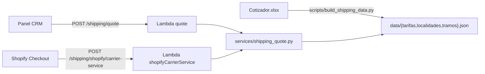

# Servicio `shipping` — cotizador y Shopify CarrierService

Este servicio implementa la cotización de envíos basada en el Excel
**`Cotizador - Tarifa COM. DE ART. DE PROTECCION 2026_1S T.xlsx`** y expone
los siguientes endpoints:

| Endpoint | Auth | Uso |
|---|---|---|
| `POST /api/v1/shipping/quote` | Cognito Bearer | Cotizador interno (CRM/admin) |
| `GET /api/v1/shipping/localidades` | Cognito Bearer | Autocomplete de destinos |
| `POST /api/v1/shipping/shopify/carrier-service` | Pública (filtro por shop) | Callback de Shopify CarrierService durante checkout |
| `GET /api/v1/shipping/shopify/registration` | Cognito Bearer | Listar carrier services en la tienda (`read_shipping`) |
| `POST /api/v1/shipping/shopify/registration` | Cognito Bearer (ADMIN) | Crear carrier service (`write_shipping`) |
| `PATCH /api/v1/shipping/shopify/registration/{id}` | Cognito Bearer (ADMIN) | Actualizar (`write_shipping`) |
| `DELETE /api/v1/shipping/shopify/registration/{id}` | Cognito Bearer (ADMIN) | Borrar (`write_shipping`) |

## Arquitectura



- **Sin base de datos:** los JSONs se empaquetan con la Lambda y se cargan
  con `lru_cache` (singleton por contenedor). ~1.2 MB de tarifas + 47 KB
  de localidades.
- **Origen fijo:** `SCL` (Santiago) por default. Override por env
  `SHIPPING_ORIGIN_SUCURSAL` si en el futuro despachan desde otra bodega.
- **IVA:** 19 % por default (`SHIPPING_IVA_PCT`); se puede pisar por
  request en el endpoint interno.

## Reglas de cálculo

Tomadas de la hoja `RESUMEN` del Excel y validadas contra la hoja
`COTIZADOR`:

1. `kg_físico = sum(peso_kg)` por bulto.
2. `kg_volumétrico = sum(alto * largo * ancho / 1_000_000) * 250` (en cm³ → m³).
3. `kg_cobrable = max(1, kg_físico, kg_volumétrico)` (mínimo 1 kg).
4. **Localidad → sucursal + zona** se busca en `LOCALIDADES` (510 entradas,
   normalizadas con `unicodedata` + uppercase).
5. **Tramo** se elige por `kg_cobrable`: `0-5, 6-10, 11-20, 21-30, 31-40,
   41-50, 51-100, 101-200, 201-500, 501-1000, 1001-2000, 2001-5000,
   5001-10000`.
6. **Tarifa** se obtiene de `TARIFAS` por `ORIGEN-DESTINO-ZONA-TRAMO` →
   `{tarifa CLP/kg, mínimo CLP}`.
7. `subtotal_T1 = max(mínimo, kg_cobrable * tarifa)`.
8. **Regla 10 ("ningún precio inferior al máximo del tramo anterior"):**
   `subtotal_T2 = max(mínimo_previo, max_kg_previo * tarifa_previa)`.
9. `total_neto = max(subtotal_T1, subtotal_T2)`.
10. `total_con_iva = round(total_neto * 1.19)` (Chile).
11. CLP no usa decimales: el resultado se redondea a entero.

> Si la localidad **no está** en el listado, los endpoints devuelven 404
> (interno) o `{"rates": []}` (callback Shopify) — el área de ventas
> tasa esos casos manualmente.

## Endpoint interno — `POST /api/v1/shipping/quote`

Header: `Authorization: Bearer <Cognito access_token>`

Body:

```json
{
  "destination_locality": "Antofagasta",
  "packages": [
    { "weight_kg": 5, "height_cm": 30, "length_cm": 40, "width_cm": 25 },
    { "weight_kg": 2, "height_cm": 10, "length_cm": 30, "width_cm": 20 }
  ],
  "origin": "SCL",
  "iva_pct": 19
}
```

- `destination_locality` — string. Acepta variantes con/sin tildes y
  mayúsculas/minúsculas.
- `packages[]` — opcional. Si vacío, `kg_cobrable` = 1 (mínimo del tramo
  0-5).
- `origin` — opcional. Default `SHIPPING_ORIGIN_SUCURSAL` (`SCL`).
- `iva_pct` — opcional. Default `SHIPPING_IVA_PCT` (19).

Respuesta (200):

```json
{
  "statusCode": 200,
  "message": "OK",
  "data": {
    "origin": "SCL",
    "destination_sucursal": "ANF",
    "destination_zona": "B",
    "locality_input": "Antofagasta",
    "locality_matched": "ANTOFAGASTA",
    "kg_fisico": 7.0,
    "kg_volumetrico": 16.5,
    "kg_cobrable": 16.5,
    "tramo": "11-20",
    "tramo_anterior": "6-10",
    "tarifa_clp_kg": 1100.5,
    "minimo_clp": 18154.0,
    "subtotal_t1_clp": 18158.25,
    "subtotal_t2_clp": 18154.0,
    "total_neto_clp": 18158,
    "total_con_iva_clp": 21608,
    "iva_pct": 19.0
  }
}
```

Errores:

- `400` — body inválido (e.g. `quantity` no numérico).
- `401` — sin Bearer token o token inválido.
- `404` — localidad no está en el listado.

## Endpoint Shopify CarrierService — `POST /api/v1/shipping/shopify/carrier-service`

Sin auth Shopify (la API CarrierService no envía HMAC). Defensa en
profundidad: se valida `X-Shopify-Shop-Domain` contra
`SHIPPING_ALLOWED_SHOP_DOMAINS` (CSV) si está definida.

Request (formato Shopify, [docs](https://shopify.dev/docs/api/admin-rest/latest/resources/carrierservice)):

```json
{
  "rate": {
    "origin": { "country": "CL", "city": "Santiago", "province": "RM" },
    "destination": {
      "country": "CL",
      "city": "Antofagasta",
      "province": "Antofagasta",
      "postal_code": "1240000"
    },
    "items": [
      {
        "name": "Casco con Visera",
        "sku": "AC-100",
        "quantity": 2,
        "grams": 1500,
        "requires_shipping": true
      }
    ],
    "currency": "CLP",
    "locale": "es-CL"
  }
}
```

Respuesta (200):

```json
{
  "rates": [
    {
      "service_name": "Apro Click — Carga consolidada",
      "service_code": "aproclick_consolidada",
      "total_price": "1290000",
      "currency": "CLP",
      "description": "ANF (B) — 3 kg cobrables"
    }
  ]
}
```

> ⚠️ **CLP es sin subunidades.** Shopify exige multiplicar por 100. El
> handler hace `int(total_con_iva_clp) * 100`. Es decir, **12 900 CLP** se
> envía como `"total_price": "1290000"`.

### Comportamiento ante errores

| Caso | Respuesta |
|---|---|
| Localidad fuera del listado | `200 {"rates": []}` (Shopify mostrará otras opciones de envío) |
| Currency != CLP | `200 {"rates": []}` |
| Shop no permitido | `401 {"error":"shop not allowed"}` |
| Error inesperado | `404 {"error":"internal"}` (Shopify usa **backup rates** del merchant) |
| Body sin `rate.destination.city`/`province` | `200 {"rates": []}` |

### Volumétrico en el callback (placeholder)

Shopify **no envía dimensiones** por línea (sólo `grams`). Mientras no
tengamos dimensiones reales por variante, asumimos un **cubo de
`SHIPPING_DEFAULT_PKG_CM` lado por unidad vendida** (default `10` cm).

Eso produce **0,25 kg volumétricos por unidad** (`10 × 10 × 10 / 1.000.000
× 250`). Para una línea con `quantity = 4`, el handler genera 4 paquetes
de `{grams/1000, 10, 10, 10}` y suma kg físico/volumétrico antes de
elegir el cobrable.

Cómo mejorarlo cuando tengamos data real (sin redeploy del checkout):

1. Subir `SHIPPING_DEFAULT_PKG_CM` por env si querés un valor más
   conservador para todo el catálogo (e.g. `15`).
2. Agregar metafields `aproclick.dim_alto/largo/ancho` por variante y
   leerlos en el handler con una consulta GraphQL antes de cotizar
   (reemplazando `_packages_from_items`).
3. Forzar a la app/tema a setear `properties` por línea con dimensiones.

El endpoint **interno** ya soporta volumétrico real desde el día uno
(recibe alto/largo/ancho en el body).

## Variables de entorno

| Var | Default | Descripción |
|---|---|---|
| `COGNITO_USER_POOL_ID` | — (Fn::ImportValue del servicio users) | Para validar Bearer en el endpoint interno |
| `SHIPPING_ORIGIN_SUCURSAL` | `SCL` | Sucursal origen por default |
| `SHIPPING_IVA_PCT` | `19` | IVA Chile |
| `SHIPPING_SERVICE_NAME` | `Apro Click — Carga consolidada` | Nombre que ve el cliente en checkout |
| `SHIPPING_SERVICE_CODE` | `aproclick_consolidada` | Código estable del servicio (NO debe cambiar entre requests del mismo método) |
| `SHIPPING_DEFAULT_PKG_CM` | `10` | Lado del cubo asumido por unidad en el callback Shopify (placeholder hasta tener dim por variante) |
| `SHIPPING_ALLOWED_SHOP_DOMAINS` | `` | CSV de shops permitidos para el callback. Vacío = sin filtro |
| `DATABASE_URL` | — | PostgreSQL para el handler administrativo (lee `shopify_app_installations.shopify_access_token`) |
| `SHIPPING_SHOPIFY_API_VERSION` | `2026-04` | Versión Admin API usada por las mutations `carrierService*` |

## Datos del Excel

Los JSONs se generan ad-hoc con:

```bash
python3 scripts/build_shipping_data.py
```

Output en `src/services/shipping/data/`:

- `localidades.json` — 510 destinos → `{sucursal, zona, display_name}`.
- `tarifas.json` — `[origen][destino][zona][tramo] = {tarifa, minimo}` (~25k entradas).
- `tramos.json` — orden de los 13 tramos con `from_kg`/`to_kg`.

Cuando llegue una versión nueva del Excel:

1. Reemplazar el archivo en `docs/`.
2. Ejecutar el script de pre-procesamiento.
3. Commitear los JSONs.
4. `npm run deploy:service -- shipping`.

## Registro del CarrierService en Shopify

### Scopes requeridos en `shopify.app.toml`

Sumar a la lista de scopes (separados por coma) en la app Shopify y
reinstalar la app para que el merchant los acepte:

| Scope | Para qué |
|---|---|
| `write_shipping` | `carrierServiceCreate`, `carrierServiceUpdate`, `carrierServiceDelete` |
| `read_shipping`  | `carrierServices` (listar) |

Si los scopes no están, Shopify devuelve `ACCESS_DENIED` y los endpoints
de `registration` responden `502 Bad Gateway` con el detalle.

### Endpoint administrativo (preferido)

`POST /api/v1/shipping/shopify/registration` — crea el CarrierService
desde el panel/CRM. Header `Authorization: Bearer <Cognito access_token>`.
Sólo `SUPERADMIN` o `ADMIN`.

Body:

```json
{
  "name": "Apro Click",
  "callback_url": "https://<API_ID>.execute-api.us-east-2.amazonaws.com/api/v1/shipping/shopify/carrier-service",
  "supports_service_discovery": true,
  "active": true,
  "shop_domain": "aproclick.myshopify.com"
}
```

- `shop_domain` es opcional: si no viene, usa la última instalación
  activa registrada en `shopify_app_installations`.
- Respuesta:

```json
{
  "statusCode": 200,
  "message": "OK",
  "data": {
    "id": "gid://shopify/DeliveryCarrierService/...",
    "name": "Apro Click",
    "callbackUrl": "https://...",
    "active": true,
    "supportsServiceDiscovery": true
  }
}
```

Operaciones siguientes:

```bash
# Listar (read_shipping)
curl https://<API>/api/v1/shipping/shopify/registration -H "Authorization: Bearer $TOKEN"

# Actualizar (write_shipping) — id puede ser gid o número
curl -X PATCH https://<API>/api/v1/shipping/shopify/registration/1036895102 \
  -H "Authorization: Bearer $TOKEN" \
  -H "Content-Type: application/json" \
  -d '{"active": false}'

# Borrar (write_shipping)
curl -X DELETE "https://<API>/api/v1/shipping/shopify/registration/1036895102?shop_domain=aproclick.myshopify.com" \
  -H "Authorization: Bearer $TOKEN"
```

### Alternativa manual (sin pasar por el endpoint)

```graphql
mutation {
  carrierServiceCreate(input: {
    name: "Apro Click",
    callbackUrl: "https://<API_ID>.execute-api.us-east-2.amazonaws.com/api/v1/shipping/shopify/carrier-service",
    supportsServiceDiscovery: true,
    active: true
  }) {
    carrierService { id name callbackUrl active }
    userErrors { field message }
  }
}
```

> Sólo la app que crea el carrier puede actualizarlo después.

## Deploy

```bash
npm run deploy:service -- shipping        # default stage dev / mh-prod
npm run deploy:service -- shipping prod
```

El servicio depende del stack `apro-click-admin-users-<stage>` (importa el
ARN del User Pool). Ese servicio debe estar deployado antes.

## Verificación rápida

```bash
# 1) Health
curl https://<API>/api/v1/health-shipping

# 2) Cotizar (token de Cognito)
curl -X POST https://<API>/api/v1/shipping/quote \
  -H "Authorization: Bearer $TOKEN" \
  -H "Content-Type: application/json" \
  -d '{"destination_locality":"Antofagasta","packages":[{"weight_kg":7}]}'

# 3) Carrier service callback (formato Shopify)
curl -X POST https://<API>/api/v1/shipping/shopify/carrier-service \
  -H "Content-Type: application/json" \
  -d '{
    "rate": {
      "destination": {"city":"Antofagasta","country":"CL"},
      "items": [{"grams":1000,"quantity":1,"requires_shipping":true}],
      "currency": "CLP"
    }
  }'
```
