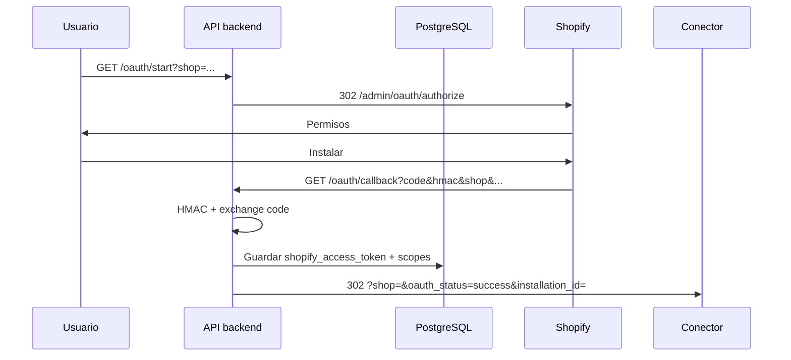

# Shopify OAuth — backend + conector

El backend (`apro-click-admin-shopify`):

1. **`GET /api/v1/shopify/oauth/start`** — Redirige (302) a Shopify `/admin/oauth/authorize`. Query opcional **`shop`** (`*.myshopify.com` o solo subdominio). Si omites `shop`, se usa la tienda activa en `shopify_app_installations`.
2. **`GET /api/v1/shopify/oauth/callback`** — URL registrada como **redirect** en Partners. Valida **HMAC**, intercambia `code` → **access token** y persiste **`shopify_access_token`** en PostgreSQL (columna `TEXT`), más **`scopes`** e **`installed_at`**. La columna legacy `access_token_secret_id` se deja en NULL. Luego **302** a **`SHOPIFY_CONNECTOR_URL`**: `shop`, `oauth_status=success`, `installation_id` (sin exponer el token).

Documentación Shopify: [Authorization code grant](https://shopify.dev/docs/apps/build/authentication-authorization/access-tokens/authorization-code-grant).

---

## Configuración en Partners (app)

| Campo | Valor |
|--------|--------|
| **Allowed redirection URL(s)** | `{HTTPS_API}/api/v1/shopify/oauth/callback` (= `SHOPIFY_OAUTH_REDIRECT_URI`) |
| **Client ID / Secret** | En Lambda: `SHOPIFY_CLIENT_ID` y `SHOPIFY_CLIENT_SECRET` (el secret es necesario para HMAC y token exchange en el servidor) |

---

## Variables de entorno

| Variable | Uso |
|----------|-----|
| `SHOPIFY_CLIENT_ID` | Authorize + token exchange |
| `SHOPIFY_CLIENT_SECRET` | HMAC + `POST /admin/oauth/access_token` |
| `SHOPIFY_OAUTH_SCOPES` | Scopes separados por comas |
| `SHOPIFY_OAUTH_REDIRECT_URI` | Igual que la redirect URL registrada en la app |
| `SHOPIFY_CONNECTOR_URL` | Donde el usuario aterriza tras OAuth exitoso (query segura abajo) |
| `DATABASE_URL` | Lectura/escritura en `shopify_app_installations` |

---

## Flujo

---

## Conector frontend tras el 302

La URL final es del estilo:

`SHOPIFY_CONNECTOR_URL?shop=mis-tienda.myshopify.com&oauth_status=success&installation_id=<uuid>`.

Ahí puedes mostrar “conexión correcta”. **No** recibes el access token en la URL (queda en la columna **`shopify_access_token`** en RDS).

---

## App Bridge: “¿estás fuera del Admin de Shopify?”

[Shopify App Bridge](https://shopify.dev/docs/api/app-bridge) solo está disponible cuando la **app se carga dentro del iframe del Admin** de la tienda (o en flujos que embed provider habilita). Si abrís el conector en **localhost** o en un dominio **fuera** del Admin, verás mensajes del tipo *App Bridge no disponible* o *conexión no válida*: es esperable.

Opciones:

- Abrir la app desde **Tienda → Apps → tu app** (ruta embebida).
- Para desarrollo, usar **Shopify CLI** `shopify app dev` con túnel y URL de app permitida en Partners.
- Si la app es **solo redirect OAuth** sin UI embebida, no uses App Bridge en esa pantalla: mostrá una página standalone que solo lea `oauth_status=success` de la query.

---

## Base de datos

- Sin `?shop=` en `/start`: hace falta fila activa en `shopify_app_installations` (o 404).
- Con `?shop=`: puede ser primera instalación; el callback **crea o actualiza** la fila y el secreto.

---

## Notas

- **`to_dict()` del modelo no incluye** `shopify_access_token` ni `access_token_secret_id` para no filtrar secretos por API.
- Ejecutá migración Alembic **`002_shopify_access_token_column`** antes de depender de la columna en producción.
