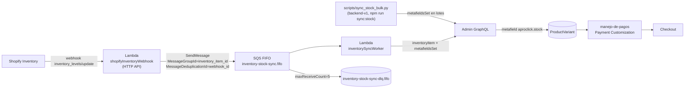

# Sync de stock para `manejo-de-pagos` (Payment Customization Function)

Este documento describe **cómo alimentar** el metafield `aproclick.stock` que la
Function `extensions/manejo-de-pagos` usa para decidir qué métodos de pago
mostrar en checkout.

## TL;DR del flujo



- **Carga inicial (one-shot):** `npm run sync:stock` en la raíz de **este**
  backend (`scripts/sync_stock_bulk.py`).
- **Tiempo real (continuo):** este repo serverless. El webhook valida HMAC y
  encola en SQS FIFO; un worker resuelve `inventoryItem -> variant`, suma el
  available entre locations activas y escribe `metafieldsSet`.

---

## Pre-requisitos

| Requisito | Cómo verificar |
|---|---|
| Definición del metafield `aproclick.stock` (number_integer, ownerType PRODUCTVARIANT) creada en la tienda | `metafieldDefinitions` query con `ownerType: PRODUCTVARIANT, namespace: "aproclick"` |
| Function `manejo-de-pagos` deployada (`shopify app deploy`) | `shopifyFunctions` query con `apiType: "payment_customization"` |
| `PaymentCustomization` activado en la tienda | `paymentCustomizations` query — debe existir uno con `enabled: true` y el `functionId` correspondiente |
| Scope `write_products` en `shopify.app.toml` | Ya está. Sirve para escribir metafields de variante. |
| Scope `read_inventory` | Ya está. Lo necesita el handler para resolver inventory_item → variant + sumar locations. |

> Si todavía no creaste la definición del metafield, usá `metafieldDefinitionCreate` **sin** el campo `access` (para namespace público los únicos válidos son los defaults; ver issue conocido más abajo).

---

## Carga inicial — `scripts/sync_stock_bulk.py`

Está pensado para correrse **una vez** (o ad-hoc cada tanto si se desincroniza).

Fusiona `.env` en la raíz del backend (opcional `--env-file otra/ruta`; no pisá variables ya exportadas en la shell):

```bash
# .env
SHOPIFY_SHOP=tu-tienda.myshopify.com
SHOPIFY_ADMIN_TOKEN=shpat_xxx
```

### Modos disponibles

| Comando | Qué hace | Cuándo usarlo |
|---|---|---|
| `npm run sync:stock` | Sync **solo** de variantes con `stock > 0` (`--only-positive` por default) | **Default seguro.** Mientras Apro Click no está 100% sincronizado, evita marcar variantes como OOS por estar mal el stock en Shopify |
| `npm run sync:stock:all` | Sync de **todas** las variantes tracked (incluye stock 0 y negativo) | Cuando confirmás que el stock en Shopify refleja la realidad |
| `npm run sync:stock:dry` | Preview con `--only-positive`: cuenta cuántos metafields escribiría | Validación antes de ejecutar |

### Lógica del default `--only-positive`

La function trata las variantes así:

| Estado del metafield | Interpretación de la function |
|---|---|
| Sin metafield | "in stock" — no fuerza ocultamiento |
| `value` numérico > 0 | "in stock" — no fuerza ocultamiento |
| `value` numérico ≤ 0 | "OOS" — oculta todo lo que no esté en `reviewMethodNames` |

Por eso `--only-positive` no escribe metafields para las variantes que Shopify reporta en 0: si todavía no podés confiar 100% en ese 0, **mejor no marcarlas**, que ningún cliente reciba el flujo "solo método de revisión" por error.

### Variables/flags

| Variable / Flag | Default | Qué hace |
|---|---|---|
| `SHOPIFY_SHOP` | (req) | Dominio `*.myshopify.com` |
| `SHOPIFY_ADMIN_TOKEN` | (req) | Offline access token con `write_products` |
| `SHOPIFY_API_VERSION` | `2026-04` | Sincronizado con la function |
| `STOCK_NAMESPACE` | `aproclick` | Namespace del metafield |
| `STOCK_KEY` | `stock` | Key del metafield |
| `--dry-run` | off | No escribe metafields, solo cuenta |
| `--only-positive` | off (sí en `npm run sync:stock`) | Solo escribe variantes con `stock > 0` |
| `--out=<path>` | `./bulk-stock.jsonl` | Path donde guarda el export |
| `--reuse` | off | Reutiliza el JSONL existente (no relanza el bulk export) |
| `--batch-size=<n>` | `25` | Lote para `metafieldsSet` (max 25 por call) |
| `--rate-ms=<n>` | `250` | Delay entre lotes (subir si hay throttling) |

### Bajo el capot

1. Dispara `bulkOperationRunQuery` con todas las `productVariants` (id + inventoryQuantity + inventoryItem.tracked).
2. Pollea `currentBulkOperation` cada 3s hasta `COMPLETED`.
3. Descarga el JSONL.
4. Filtra variantes con `tracked = false` (no las pisa con 0).
5. Si `--only-positive`, filtra también las que tienen `inventoryQuantity ≤ 0`.
6. Empuja `metafieldsSet` en lotes de 25.

---

## Tiempo real — Webhook `inventory_levels/update` + worker SQS FIFO

Implementado en este repo dentro del servicio `orders`:

| Pieza | Archivo |
|---|---|
| Handler HTTP que recibe el webhook | [src/services/orders/handlers/shopify_inventory_webhook.py](../src/services/orders/handlers/shopify_inventory_webhook.py) |
| Worker SQS que aplica el sync | [src/services/orders/handlers/inventory_sync_worker.py](../src/services/orders/handlers/inventory_sync_worker.py) |
| Lógica de negocio (GraphQL + metafield) | [src/services/orders/services/shopify_inventory_metafield.py](../src/services/orders/services/shopify_inventory_metafield.py) |
| Cliente Admin GraphQL compartido | [src/services/orders/utils/shopify_graphql.py](../src/services/orders/utils/shopify_graphql.py) |
| Validación HMAC reutilizada | [src/services/orders/utils/shopify_webhook.py](../src/services/orders/utils/shopify_webhook.py) |
| Cola FIFO + DLQ + IAM | [src/services/orders/serverless.yml](../src/services/orders/serverless.yml) |

### Configuración Shopify (otro repo)

```toml
[[webhooks.subscriptions]]
topics = ["inventory_levels/update"]
uri = "https://<api-id>.execute-api.us-east-2.amazonaws.com/api/v1/inventory/shopify/webhook"
```

> Aplicado con `shopify app deploy`. El topic se discrimina vía header
> `X-Shopify-Topic`, igual que ya se hace con orders. Tras `npm run
> deploy:service -- orders` copiá la URL real del API y poneola en
> `shopify.app.toml`.

### Payload del webhook

`POST https://.../api/v1/inventory/shopify/webhook`

Headers relevantes:

```
X-Shopify-Topic: inventory_levels/update
X-Shopify-Hmac-Sha256: <hmac>
X-Shopify-Shop-Domain: <shop>.myshopify.com
X-Shopify-Webhook-Id: <uuid>
X-Shopify-Triggered-At: <iso8601>
```

Body:

```json
{
  "inventory_item_id": 49148385,
  "location_id": 655441491,
  "available": 5,
  "updated_at": "2026-05-04T17:04:11-05:00"
}
```

### Flujo end-to-end

1. **Webhook handler** (`shopifyInventoryWebhook`, timeout 6s):
   - Filtra topics distintos a `inventory_levels/update` con 200 ignored.
   - Verifica HMAC con `SHOPIFY_CLIENT_SECRET` (mismo secret que orders).
   - `SendMessage` a la cola FIFO con:
     - `MessageGroupId = inventory_item_id` → coalescing y orden por item.
     - `MessageDeduplicationId = X-Shopify-Webhook-Id` → dedup nativo 5 min.
   - Responde 200 inmediato (ack a Shopify).
2. **SQS FIFO** (`apro-click-<stage>-inventory-stock-sync.fifo`):
   - `DeduplicationScope: messageGroup` + `FifoThroughputLimit:
     perMessageGroupId` para escalar horizontal por item.
   - `VisibilityTimeout: 90s` (3× el timeout del worker).
   - `RedrivePolicy.maxReceiveCount: 5` → DLQ tras 5 reintentos.
3. **Worker** (`inventorySyncWorker`, timeout 28s, batchSize 10,
   `ReportBatchItemFailures`):
   - Resuelve `(shop_domain, access_token)` desde
     `shopify_app_installations` en Postgres.
   - Llama `inventoryItem(id).inventoryLevels.edges.node` y suma
     `quantities(available)` filtrando `location.isActive`.
   - Escribe `metafieldsSet` con `namespace=SHOPIFY_STOCK_NAMESPACE`,
     `key=SHOPIFY_STOCK_KEY` (`aproclick.stock` por default),
     `type=number_integer`, `value=str(total)`.
   - Devuelve `batchItemFailures` por mensaje fallido → SQS reentrega solo
     ese, los demás se borran.

### Idempotencia, coalescing y reintentos (cómo cumple cada requisito)

| Requisito | Cómo se cumple |
|---|---|
| HMAC obligatorio | `verify_shopify_webhook` + `SHOPIFY_CLIENT_SECRET` (rechaza con 401 antes de encolar) |
| Idempotencia | `MessageDeduplicationId = X-Shopify-Webhook-Id` (5 min de dedup window automático) |
| Coalescing por item | `MessageGroupId = inventory_item_id`: SQS FIFO procesa los mensajes del mismo grupo en orden y permite throughput per-group |
| Reintentos | SQS reentrega cada 90s; tras 5 fallos baja a la DLQ FIFO con retención de 14 días |
| Throttling de Admin API | El worker re-lanza el error y SQS reentrega; el dedup window evita pisarse |

### Métricas sugeridas (CloudWatch)

- `shopifyInventoryWebhook` log filters: ``inventory webhook — mensaje encolado`` (éxito al encolar); `HMAC inválido`, `enqueue failed`,
  `INVENTORY_SYNC_QUEUE_URL no configurado`.
- `inventorySyncWorker` log filters (`inventory sync ok`, `inventory sync skip`,
  `inventory sync — error inesperado`).
- Métricas built-in de la cola: `ApproximateNumberOfMessagesVisible`,
  `ApproximateAgeOfOldestMessage`, `NumberOfMessagesSent`, y de la DLQ:
  `ApproximateNumberOfMessagesVisible > 0` debe disparar alerta.

### Por qué este flujo y no leer inventario en la function

Las Shopify Functions **no exponen** `inventoryQuantity` ni `availableForSale`
en el `ProductVariant` del input. Tampoco soportan network access en
Payment Customization. La única forma estable de exponer "stock" a la function
es **un metafield**, y este flujo es el que lo mantiene actualizado.

---

## Activación del PaymentCustomization (one-shot)

Después de hacer `shopify app deploy` por primera vez:

```graphql
# 1) Encontrar el functionId
query MyFunctions {
  shopifyFunctions(first: 25, apiType: "payment_customization") {
    nodes { id title app { title } }
  }
}

# 2) Crear el PaymentCustomization activado
mutation Create($input: PaymentCustomizationInput!) {
  paymentCustomizationCreate(paymentCustomization: $input) {
    paymentCustomization { id title enabled }
    userErrors { field message code }
  }
}
```

Variables:

```json
{
  "input": {
    "title": "Manejo de Pagos por Stock",
    "enabled": true,
    "functionId": "FUNCTION_ID_AQUI",
    "metafields": [
      {
        "namespace": "$app:manejo-de-pagos",
        "key": "function-configuration",
        "type": "json",
        "value": "{\"reviewMethodNames\":[\"Enviar pedido (sujeto a revisión)\"]}"
      }
    ]
  }
}
```

> El campo `metafields` permite **sobreescribir el array hardcoded** de la
> function (`DEFAULT_REVIEW_METHOD_NAMES` en
> `extensions/manejo-de-pagos/src/cart_payment_methods_transform_run.ts`).
> Si lo dejás sin pasar, la function usa los defaults del código.

---

## Verificación end-to-end

1. Crear la definición del metafield (una sola vez).
2. `shopify app deploy` para subir la function actualizada con el webhook.
3. Setear UNA variante con stock 0 a mano:
   ```graphql
   mutation { metafieldsSet(metafields: [{
     ownerId: "gid://shopify/ProductVariant/...",
     namespace: "aproclick", key: "stock",
     type: "number_integer", value: "0"
   }]) { userErrors { message } } }
   ```
4. Crear el `PaymentCustomization` (mutación de arriba).
5. Agregar esa variante al carrito en checkout y abrir Pago.
6. Mirar logs en **Partners → Apps → Apro Click Connector → Extensions → manejo-de-pagos → Logs**.
   - `input` debe mostrar `merchandise.stock.value = "0"`.
   - `output.operations` debe ocultar todos los métodos NO-revisión.
7. Cambiar la variante a stock `5`, repetir. Ahora la function debería ocultar
   solo el método "Enviar pedido (sujeto a revisión)".

---

## Troubleshooting

| Síntoma | Causa probable | Fix |
|---|---|---|
| `merchandise.stock` viene `null` aunque el metafield existe | No hay definición de metafield, o el namespace no matchea | Crear `metafieldDefinitionCreate` con `namespace: "aproclick"` y `ownerType: PRODUCTVARIANT` |
| `metafieldDefinitionCreate` falla con "Debe ser uno de [public_read_write]" | Pasaste `access` con un valor no permitido en namespaces públicos | Quitá la key `access` del input. El default es válido. |
| `paymentCustomizationCreate` falla con "Function not found" | `functionId` mal copiado o app sin deploy | Volver a correr `shopifyFunctions(apiType: "payment_customization")` |
| `paymentCustomizationCreate` falla con "Access denied" | Falta scope `write_payment_customizations` | Sumarlo a `shopify.app.toml` y reinstalar app |
| `webhooks/inventory_levels/update` no llega | El topic no está suscrito a la URL correcta | Verificar `shopify.app.toml`, redeploy, y mirar Partners → Webhooks |
| `metafieldsSet` devuelve `THROTTLED` en bulk | Lotes muy grandes o `--rate-ms` muy bajo | Subir `--rate-ms=500` o más |
| Function logs no aparecen | Ejecuciones cacheadas | Cambiar el cart (agregar/quitar item) para forzar nueva ejecución |

---

## Mantenimiento del array `reviewMethodNames`

La function tiene **dos fuentes** para el array de métodos "de revisión":

1. **Código** — `DEFAULT_REVIEW_METHOD_NAMES` en
   `extensions/manejo-de-pagos/src/cart_payment_methods_transform_run.ts`.
   Cambia → requiere `shopify app deploy`.

2. **Metafield del PaymentCustomization** —
   `$app:manejo-de-pagos.function-configuration`, key `reviewMethodNames`.
   Cambia → no requiere redeploy de la function. Se actualiza con
   `paymentCustomizationUpdate`:

   ```graphql
   mutation Update($id: ID!, $input: PaymentCustomizationInput!) {
     paymentCustomizationUpdate(id: $id, paymentCustomization: $input) {
       paymentCustomization { id }
       userErrors { field message }
     }
   }
   ```

   Variables:

   ```json
   {
     "id": "gid://shopify/PaymentCustomization/...",
     "input": {
       "title": "Manejo de Pagos por Stock",
       "enabled": true,
       "functionId": "FUNCTION_ID",
       "metafields": [
         {
           "namespace": "$app:manejo-de-pagos",
           "key": "function-configuration",
           "type": "json",
           "value": "{\"reviewMethodNames\":[\"Enviar pedido (sujeto a revisión)\",\"Otro método\"]}"
         }
       ]
     }
   }
   ```

Si está el metafield, la function usa **ese** array y ignora el default del código.
